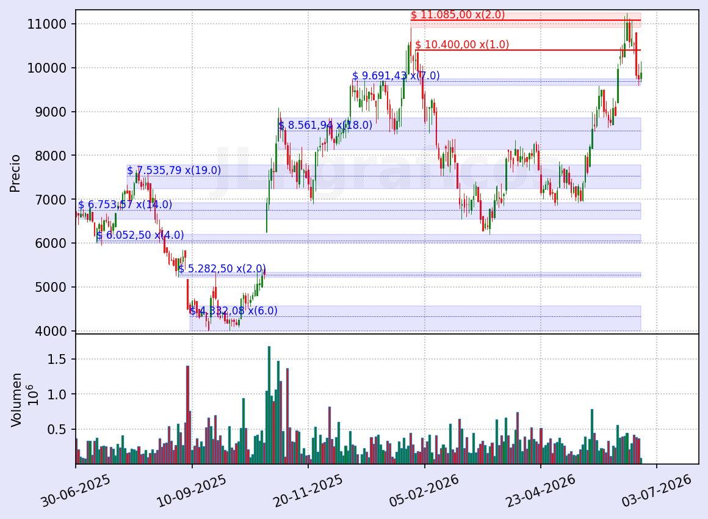
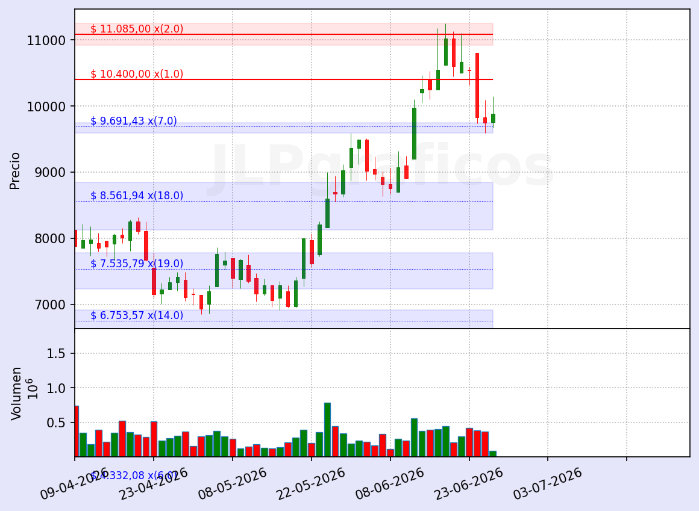
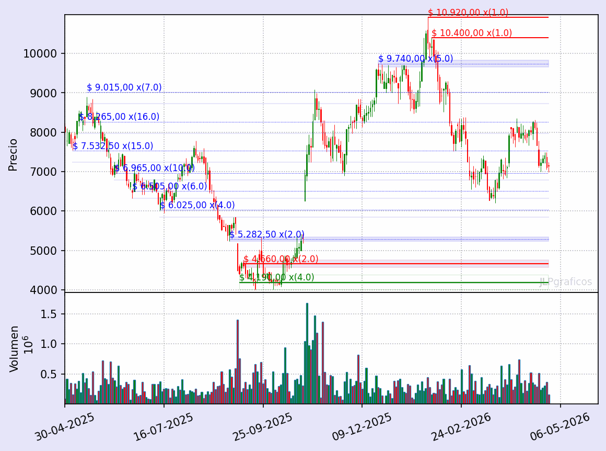

# Structural Support & Resistance for Argentine Equities

*[Español abajo ⬇](#soportes-y-resistencias-estructurales-para-acciones-argentinas)*

A structural analysis engine that detects horizontal support/resistance zones on
equities using swing structure and real volume, and publishes daily updated
charts for the Argentine market (BYMA / Merval).

This repository is **descriptive**: it documents the method and shows example
output. The engine itself is proprietary.

🔗 **Live charts (daily, in Spanish):** [jlpgraficos.com.ar](https://jlpgraficos.com.ar)

---

## What it does

Given OHLC + volume data, the engine builds a map of the levels where price has
historically found support or resistance, and how many times each level has been
respected.

The pipeline has two conceptual layers:

1. **Swing detection** — a single-pass state machine identifies confirmed highs
   and lows. Each extreme carries a **confirmation date**: the date on which it
   became known, not the date it occurred.
2. **Level clustering** — nearby swings are grouped into zones using an
   ATR-based distance criterion, so the output is a small set of meaningful
   zones rather than noise.

## What makes it different

Most open-source support/resistance tools draw levels using data from the
**future** without noticing — a level looks valid because the chart already
shows how price reacted to it.

This engine tracks a **confirmation date** for every extreme, which allows an
**as-of query**:

> *"Which levels existed on date X, using only what was known up to X?"*

The answer is honest — no lookahead. For anyone doing backtesting or studying
whether a method actually had an edge in real time, this is the property that
matters, and it is rarely handled correctly.

## Example output

Levels are frozen: they were already in place before price reacted to them.

**BBAR — 1 year**

**BBAR — 3-month zoom**

**How the levels held (4-frame sequence)**

## Scope & honesty

- The levels are **descriptive**: they mark where price has reacted before.
- Turning that into a live entry mechanic — *when* a level becomes tradable — is
  ongoing work and is intentionally **not** part of this public repository.
- Nothing here constitutes financial advice.

## About

Built and maintained by an electromechanical engineer and active trader in the
Argentine market, as the engine behind [jlpgraficos.com.ar](https://jlpgraficos.com.ar).

Open to interesting conversations — feel free to reach out via GitHub.

---
---

# Soportes y Resistencias Estructurales para Acciones Argentinas

*[English above ⬆](#structural-support--resistance-for-argentine-equities)*

Un motor de análisis estructural que detecta zonas horizontales de soporte y
resistencia en acciones, usando estructura de swings y volumen real, y publica
gráficos actualizados a diario del mercado argentino (BYMA / Merval).

Este repositorio es **descriptivo**: documenta el método y muestra ejemplos de
resultado. El motor en sí es privado.

🔗 **Gráficos en vivo (diarios):** [jlpgraficos.com.ar](https://jlpgraficos.com.ar)

---

## Qué hace

A partir de datos OHLC + volumen, el motor arma un mapa de los niveles donde el
precio históricamente encontró soporte o resistencia, y cuántas veces se respetó
cada uno.

El pipeline tiene dos capas conceptuales:

1. **Detección de swings** — una máquina de estados de un solo pase identifica
   máximos y mínimos confirmados. Cada extremo lleva una **fecha de
   confirmación**: la fecha en que se volvió conocido, no la fecha en que ocurrió.
2. **Agrupamiento de niveles** — los swings cercanos se agrupan en zonas con un
   criterio de distancia basado en ATR, de modo que el resultado es un conjunto
   chico de zonas relevantes, no ruido.

## Qué lo hace distinto

La mayoría de las herramientas open-source de soporte/resistencia dibujan los
niveles usando datos del **futuro** sin darse cuenta: un nivel parece válido
porque el gráfico ya muestra cómo reaccionó el precio ante él.

Este motor registra una **fecha de confirmación** para cada extremo, lo que
permite una **consulta as-of**:

> *"¿Qué niveles existían en la fecha X, usando solo lo que se sabía hasta X?"*

La respuesta es honesta — sin lookahead. Para cualquiera que haga backtesting o
estudie si un método realmente tuvo ventaja en tiempo real, esa es la propiedad
que importa, y casi nunca se resuelve bien.

## Ejemplo de resultado

Los niveles están congelados: ya estaban puestos antes de que el precio
reaccionara ante ellos.

**BBAR — 1 año**

**BBAR — zoom 3 meses**

**Cómo aguantaron los niveles (secuencia de 4 frames)**

## Alcance y honestidad

- Los niveles son **descriptivos**: marcan dónde el precio reaccionó antes.
- Convertir eso en una mecánica de entrada en vivo —*cuándo* un nivel se vuelve
  operable— es trabajo en curso y queda **fuera** de este repositorio público a
  propósito.
- Nada de esto constituye recomendación de inversión.

## Sobre el autor

Desarrollado y mantenido por un ingeniero electromecánico y trader activo en el
mercado argentino, como el motor detrás de [jlpgraficos.com.ar](https://jlpgraficos.com.ar).

Abierto a conversaciones interesantes — podés escribirme por GitHub.
